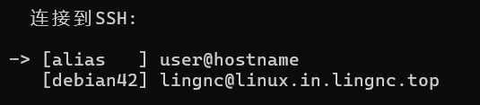

# sshmenu

从 `~/.ssh/config` 读取 SSH 主机列表，用终端交互界面选择并连接。

## 构建

```bash
make build      # 当前平台
make linux      # Linux amd64
make windows    # Windows amd64 (.exe)
```

## 使用

```bash
./sshmenu
./sshmenu --version   # 查看版本
```

## 展示



## 风格

```
   连接到SSH:

   [debian42  ] lingnc@linux.in.lingnc.top
-> [dev-server] admin@dev.example.com
   [staging   ] deploy@10.0.1.50
   [prod      ] root@prod.example.com:2222
```

## 操作

| 按键 | 功能 |
|---|---|
| j/k/↑/↓ | 移动光标 |
| 输入字符 | 实时过滤 |
| Backspace | 删除过滤字符 |
| Esc | 清除过滤 / 退出 |
| Enter | 连接选中主机 |
| q / Ctrl+C | 退出 |

## 依赖

- `golang.org/x/term`

## 发布

推送版本 tag 即可自动构建并发布到 GitHub Releases：

```bash
git tag v1.0.0
git push origin v1.0.0
```

GitHub Actions 会自动编译 linux/windows 版本并上传到 Release 页面。

## 协议

MIT License - 详见 [LICENSE](LICENSE)

© LingNc

